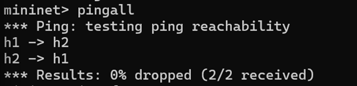
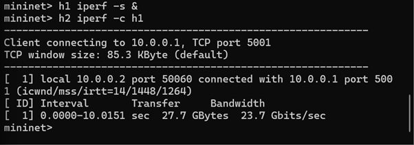
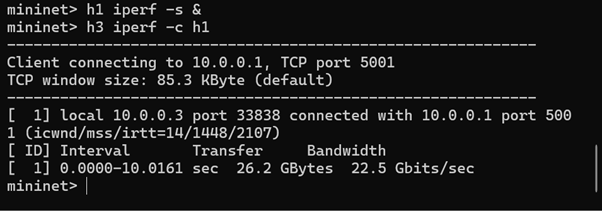

# Bandwidth Measurement and Analysis using Mininet

## Overview

This project demonstrates how to measure and analyze network bandwidth using Mininet and iperf. A virtual network is created with different topologies, and throughput is measured between hosts to study the effect of network structure on performance. This project is mainly focused on how network performance measurement changes with the toplogy.

---

## Aim

To measure and compare bandwidth across different network configurations (different topologies) using Mininet and iperf.

---

## Tools Used

* Mininet (network emulator)
* iperf (network performance measurement tool)
* Ubuntu (WSL2 environment)

---

## Concept

Mininet creates a virtual network consisting of hosts, switches, and links. Each host behaves like an independent system with its own network stack. iperf is used to generate TCP traffic between hosts and calculate bandwidth. We basically replace the required hardware with Mininet. 

---

## Procedure

### 1. Install Required Tools

```bash
sudo apt update
sudo apt install mininet iperf -y
```

### 2. Start Mininet (Default Topology)

```bash
sudo mn
```

### 3. Test Connectivity

```bash
pingall
```

Expected output: 0% packet loss

### 4. Measure Bandwidth (Topology 1)

```bash
h1 iperf -s &
h2 iperf -c h1
```

### 5. Run Different Topology

```bash
exit
sudo mn --topo single,3
```

### 6. Measure Bandwidth (Topology 2)

```bash
h1 iperf -s &
h3 iperf -c h1
```

---

## Results

| Topology   | Description       | Bandwidth        |
| ---------- | ----------------- | ---------------- |
| Topology 1 | 2 hosts, 1 switch | 23.7 Gbits/sec   |
| Topology 2 | 3 hosts, 1 switch | 22.5 Gbits/sec   |

---

## Analysis

In the first topology, bandwidth is high due to direct communication between two hosts with no competing traffic. In the second topology, multiple hosts are connected to the same switch. However, since only two hosts actively transmit data, bandwidth remains relatively high.

---

## Conclusion

Mininet effectively simulates real network environments and allows measurement of network performance without the need of hardware. Bandwidth remains high across simple topologies, and performance variations depend on resource sharing and network structure.

---

## Screenshots

### Connectivity Test


### Bandwidth Test - Topology 1


### Bandwidth Test - Topology 2


## Project Structure

```
mininet-bandwidth-analysis/
│
├── README.md
├── commands.txt
└── screenshots/
```
